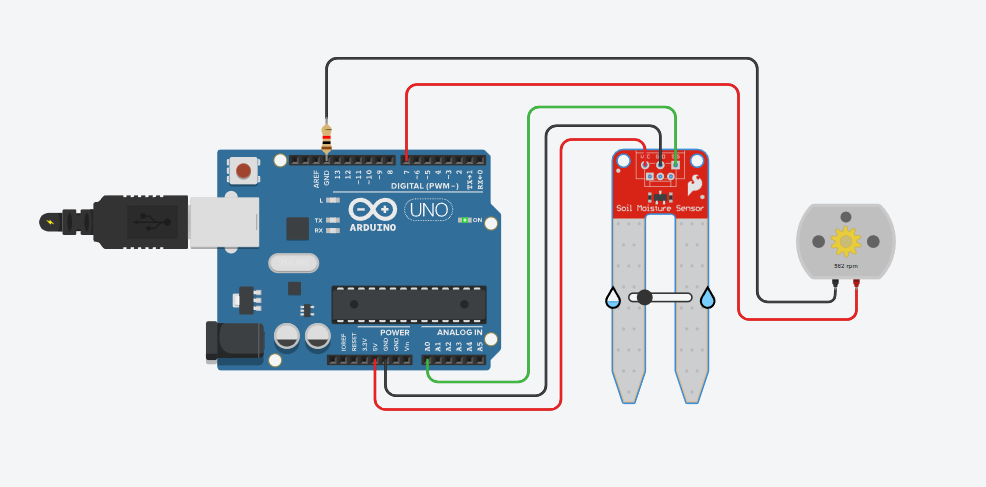

# 💧 Soil Moisture-Based Auto Irrigation System (Arduino)

This project automates irrigation using a **soil moisture sensor** and a **relay module** to control a water pump. When the soil is detected as dry (based on a threshold), the system turns **ON** the pump. When the soil is moist enough, the pump is turned **OFF**.

---

## 🚀 Features

- Automatically waters plants when soil is dry
- Real-time soil moisture monitoring via Serial Monitor
- Simple logic using analog sensor and relay
- Fully standalone and low-power

---

## 🔧 Hardware Required

| Component              | Quantity |
|------------------------|----------|
| Arduino Uno / Nano     | 1        |
| Soil Moisture Sensor   | 1        |
| Relay Module (5V)      | 1        |
| Submersible Pump (5V/12V) | 1     |
| External power supply for pump | 1 |
| Jumper wires           | As needed |
| Breadboard (optional)  | 1        |

---

## 📟 Wiring Connections

| Component            | Arduino Pin     |
|---------------------|-----------------|
| Soil Moisture Sensor (Analog Out) | A0          |
| Relay IN             | D7 (digital pin 7) |
| Relay VCC            | 5V              |
| Relay GND            | GND             |
| Sensor VCC           | 5V              |
| Sensor GND           | GND             |

- ⚠️ **Important:** Ensure the relay and pump are powered properly using an external power source (e.g., 12V adapter) if needed. Don’t power motors directly from Arduino.

---

## 📟 Connections Diagram


---

## 🎯 Customization Tips

- Adjust dryThreshold based on your sensor and soil type.
- Change delay(5000) to adjust how frequently the soil is checked.
- Add an LED or buzzer for additional status indicators.

---

## 📈 Future Enhancements

- Add an LCD or OLED display for local readings
- Integrate with Wi-Fi (ESP32) for remote monitoring
- Use RTC module for scheduled watering
- Add water level detection for pump protection

---

## 🔍 Serial Monitor Output

```cpp
Soil Moisture: 723
Pump ON
Soil Moisture: 492
Pump OFF
